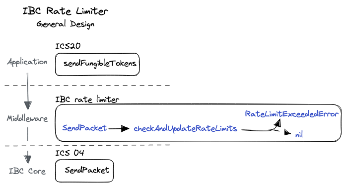
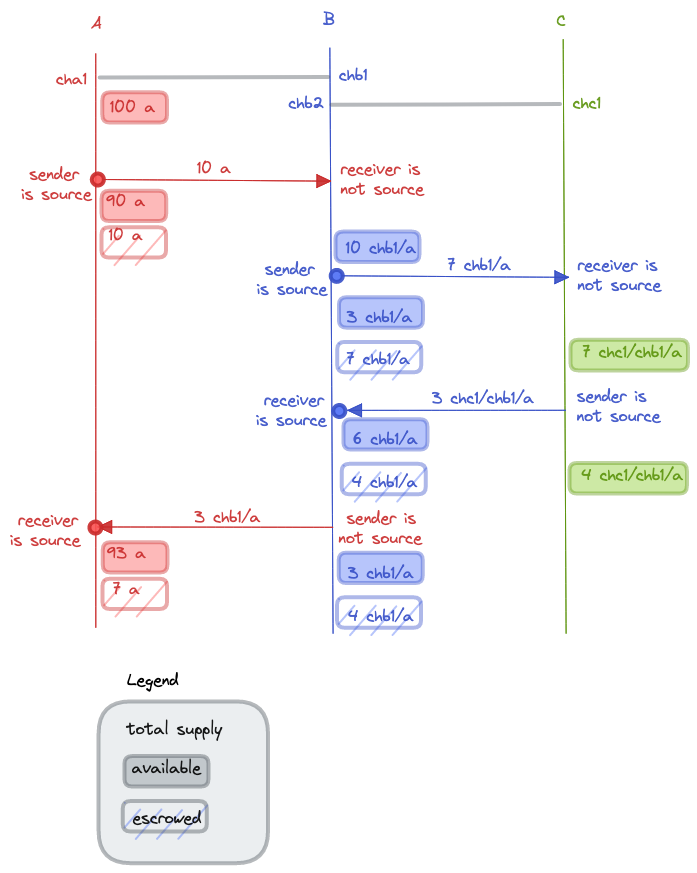

# IBC Rate Limiter

- [IBC Rate Limiter](#ibc-rate-limiter)
  - [Synopsis](#synopsis)
  - [Overview and Basic Concepts](#overview-and-basic-concepts)
    - [Motivation](#motivation)
    - [Definitions](#definitions)
  - [System Model and Properties](#system-model-and-properties)
    - [Assumptions](#assumptions)
    - [Desired Properties](#desired-properties)
  - [Technical Specification](#technical-specification)
    - [General Design](#general-design)
    - [Data Structures](#data-structures)
    - [Store Paths](#store-paths)
    - [Key Helper Functions](#key-helper-functions)
      - [Computing the Channel Value](#computing-the-channel-value)
        - [Proposal](#proposal)
      - [Checking and Updating Rate Limits](#checking-and-updating-rate-limits)
      - [Undoing a Send](#undoing-a-send)
    - [Sub-protocols](#sub-protocols)
  - [Limitations and Recommendations](#limitations-and-recommendations)
    - [Further Reading](#further-reading)

## Synopsis

This document specifies the data structures and state machine handling logic for a rate limiter module. The module is designed to intermediate between the fungible token transfer bridge module (ICS20) and IBC core. The aim of this module is to enable chains to limit the amount of tokens that are sent and received within a period of time.

The present specification is modeled after the [Osmosis IBC Rate Limit][osmosis-ibc-rate-limit] module.

## Overview and Basic Concepts

### Motivation

The IBC rate limiter can temper the impact of certain security problems. Specifically, it can prevent anomalous transfers of ICS20 funds across IBC networks.

The logic behind a rate limiter is that assets are flowing through an IBC channel at a certain rate. This is the common-case situation. In situations of exploits or bugs, however, assets typically flow at a higher (anomalous) rate; in this case, a rate limiter can prevent complete draining of a bridged asset. In other words, it acts as a throttling mechanism. The limiter can also raise awareness that an exploit might be ongoing. The [BNB hack][bnb-bridge-hack] is an example of a problem that could have been alleviated by a rate limiter.

### Definitions

`Native token` is the chain's inherent digital currency used to reward validators and as a payment method, e.g., to pay transaction fees. A token is native to a single chain. For instance, ATOM is the native token of Cosmos Hub. `Non-native tokens` are those tokens that a chain has received through IBC that are native to other chains.

`Source chain` is as defined in ICS20.

> In every token transfer, one of the two chains is the `source chain`. The sender chain is the `source chain` when the tokens are sent across a port and channel which are not equal to the last prefixed port and channel pair in the denom. For instance, if a chain A transfers its native tokens to a second chain B, then chain A is the `source chain`. The receiver chain is the `source chain` when the tokens are received across a port and channel which are equal to the last prefixed port and channel pair in the denom. For instance, if chain B transfers A's native tokens back to chain A, then chain A is the `source chain`. Note that a sender chain can be the `source chain` without sending its native token. A set of illustrative examples is discussed in [Computing the Channel Value](#computing-the-channel-value).

`FlowPath` is a triple of denom, port and channel id.

`Flow` represents the transfer of value for a denom through an IBC channel during a time window.
Tokens can flow both in and out. When a chain receives tokens, we say that they flow in. When a chain sends tokens, we say that they flow out.

A `Quota` is the percentage of the denom's total value that can be transferred through the channel in a given period of time (duration).

A `RateLimiter` is the main structure tracked for each port/channel/denom triple, i.e., for each `FlowPath`. It is associated with a `Quota` and a `Flow`. Its quota represents the rate limiter configuration, and the flow its current state.

`FungibleTokenPacketData` and `channelEscrowAddresses` is as defined in ICS20.

`Identifier`, `get`, `set`, `delete` and module-system related primitives are as defined in ICS24.

## System Model and Properties

### Assumptions

The IBC rate limiter module has access to a `bank` module similar to the one implemented in the [SDK](https://github.com/cosmos/cosmos-sdk/blob/main/x/bank/README.md). The specification assumes that this module permits the rate limiter module to query:
(i) the escrowed amount for a given port/channel/denom triple via the `bank.GetEscrowedAmount` function, and (ii) the total available supply of tokens of a given denom via the `bank.GetAvailableSupply` function.

See also [Limitations and Recommendations](#limitations-and-recommendations).

### Desired Properties

Intuitively, the desired properties of the rate limiter are as follows:

- **Preserve legitimate flow**: The IBC rate limiter does not prevent (i.e., limit nor throttle) legitimate user flow of tokens. Legitimate flow is traffic that is within the allowed percentage set by any configured `Quota` for any given `FlowPath`.
- **Prevent illegitimate flow**: The rate limiter blocks any send or receive of tokens that exceeds the allowed percentage within the preset time window (set by any configured `Quota` for any `FlowPath`).

## Technical Specification

### General Design

The rate limiter can be conceptualized as a middleware, sitting between the core IBC modules (for sending, receiving, acknowledging, or timing out packets) and the IBC application layer (ICS20 in this specific case). The figure below sketches the rate limiter design from the perspective of sending a packet ([figure source][design-figure-source]). The functions and types colored in the blue font belong to this spec.



Every time there is a fungible tokens packet sent, the rate limiter `SendPacket` function is called. This function retrieves the `FlowPath` and any rate limiter that may be set for that path, then calls into `checkAndUpdateRateLimits`, which verifies if the packet should be accepted. If the quota is reached, it throws a `RateLimitExceededError`. Otherwise the rate limiter is updated and the IBC core `SendPacket` method is called.

### Data Structures

A `FlowPath` is defined as:

```typescript
interface FlowPath {
  denom: string
  channel: Identifier
  port: Identifier
}
```

A `Flow` is defined as:

```typescript
interface Flow {
  inflow: uint
  outflow: uint
  periodEnd: uint
}
```

Tokens can flow in two directions:

```typescript
enum FlowDirection {
  IN,
  OUT
}
```

A `Quota` is defined as:

```typescript
interface Quota {
  name: string
  maxPercentageSend: uint
  maxPercentageRecv: uint
  duration: uint
  channelValue: uint
}
```

Percentages can be different for send and receive. The name of the quota is expected to be a human-readable representation of the duration (i.e.: "weekly", "daily", "every-six-months", ...).

A `RateLimiter` is a tuple of a `Quota` and a `Flow`.

```typescript
interface RateLimiter {
  quota: Quota
  flow: Flow
}
```

### Store Paths

The rate limiter path is a private path that stores rate limiters.

```typescript
function rateLimiterPath(portIdentifier: Identifier, channelIdentifier: Identifier, denom: string): Path {
    return "rateLimiter/ports/{portIdentifier}/channels/{channelIdentifier}/denom/{denom}"
}
```

### Key Helper Functions

#### Computing the Channel Value

The `computeChannelValue` function computes the channel value of a given denom depending of whether the chain is the source of the denom or not. In this specification we are proposing one possible way of computing the channel value, but one could think of alternatives. Setting the channel value has to be done carefully: it determines how many tokens can be sent or received for a period of time.

Channel value may be computed when sending or receiving tokens. Depending on whether the sender or receiving chain is the denom source or not, we have four cases:

1) Sending chain is the denom source (ICS20 escrow).
2) Receiving chain is the denom source (ICS20 un-escrow).
3) Sending chain is not the denom source (ICS20 burn).
4) Receiving chain is not the denom source (ICS20 mint).

##### Proposal

This specification proposes the following:

- For (1), channel value = the available supply of denom in the sender chain. The total supply may be very large if the denom is the chain's native token.
- For (2), channel value = escrow value (per channel and denom) on the receiver chain.
- For (3), channel value = the available supply (minted) of denom in the sender chain.
- For (4), channel value = the available supply of denom in the receiver chain.

The figure below ([figure source][denoms-figure-source]) shows a few examples of transfers that fall into the different categories described above.
There are three chains, A, B and C. One channel is created between A and B with channel identifiers `cha1` on A and `chb1` on B. A second channel is created between B and C with channel identifiers `chb2` on B and `chc1` on C. Let `a` be the native token of chain A and assume that there are `100 a` tokens minted on chain A.
The figure shows the following transfers:

- `10 a` tokens are sent from A to B - case 1: sender is the source.
  - channel value = `100 a`
  - `10 a` tokens are escrowed on A to the `cha1` escrow account.

- the `10 a` tokens from A are received on B - case 4: receiver is not the source (denom is **prefixed**).
  - channel value = `0 chb1/a`
  - `10 chb1/a` tokens are minted on B.

- `7 chb1/a` are sent from B to C - case 1: sender is the source.
  - channel value = `10 chb1/a`
  - `7 chb1/a` tokens are escrowed on B for the escrow `chb2` account.

- the `7 chb1/a` from B are received on C - case 4: receiver is not the source (denom is **prefixed**).
  - channel value = `0 chc1/chb1/a`
  - `7 chc1/chb1/a` are minted on C.

- `3 chc1/chb1/a` are sent from C **back** to B - case 3: sender is not the source.
  - channel value = `7 chc1/chb1/a`
  - `3 chc1/chb1/a` tokens are burnt on C.

- the `3 chc1/chb1/a` tokens from C are received on B - case 2: receiver is the source (denom is **un-prefixed**).
  - channel value = `7 chb1/a`
  - `3 chb1/a` are unescrowed from `chb2` account.

- `3 chb1/a` tokens are sent from B **back** to A - case 3: sender is not the source.
  - channel value = `6 chb1/a`
  - `3 chb1/a` tokens are burnt on B.

- the `3 chb1/a` tokens from B are received on A - case 2: receiver is the source (denom is **un-prefixed**).
  - channel value = `10 a`
  - `3 a` are unescrowed from `cha1` account.




As shown in the above examples, it is possible that the channel values are very small or even zero in some cases. Rate limiters should only be put in place or activated when channel values are considered high enough.

```typescript
function computeChannelValue(
    portId: Identifier,
    channelId: Identifier,
    source: bool,
    direction: FlowDirection,
    denom: string): int {
    if (source && direction === IN) {
        // Handle case (2)
        escrowAccount = channelEscrowAddresses[portId, channelId]
        return bank.GetEscrowedAmount(escrowAccount, denom)
    } else {
        // Cases (1), (3), and (4)
        return bank.GetAvailableSupply(denom)
    }
}
```

#### Checking and Updating Rate Limits

The `checkAndUpdateRateLimits` function checks whether a send or receive should be processed or not (i.e., limited) depending on the rate limiter associated to a `FlowPath`. If it is accepted, then the rate limiter is updated to account for the newly sent/received tokens.

The function introduces two concepts: flow balance and quota capacity. Flow balance is how much absolute value for the denom has moved through the channel during the current period. Quota capacity is how much value the quota allows to transfer in both directions in a given period of time.

Note that channel value is reset when the duration expires or if it has not been set. This is important: once set and while the duration does not expire, the channel value does not change.

```typescript
function checkAndUpdateRateLimits(
    portId: Identifier,
    channelId: Identifier,
    source: bool,
    denom: string,
    amount: int,
    direction: FlowDirection): error {
    // retrieve RateLimiter, quota and flow
    rateLimiter = privateStore.get(rateLimiterPath(portId, channelId, denom))
    quota = rateLimiter.quota
    flow = rateLimiter.flow
    // compute balances
    balanceIn = flow.inflow - flow.outflow
    balanceOut = flow.outflow - flow.inflow

    now = currentTimestamp()
    if (now > flow.periodEnd) {
        // period has expired, reset flow
        flow.inflow = 0
        flow.outflow = 0
        flow.periodEnd = now + quota.duration
        quota.channelValue = computeChannelValue(portId, channelId, source, direction, data.denom)
    }

    // compute capacity
    capacityIn = quota.channelValue * quota.maxPercentageRecv/100
    capacityOut = quota.channelValue * quota.maxPercentageSend/100

    // if tokens are received
    if (direction === IN) {
        if ( balanceIn + amount < capacityIn ) {
            // we haven't reached the limit
            // update inflow
            flow.inflow = flow.inflow + amount
        } else {
            // limit reached
            return RateLimitExceededError
        }
    // if tokens are sent
    } else {
        if ( balanceOut + amount < capacityOut ) {
            // we haven't reached the limit
            // update inflow
            flow.outflow = flow.outflow + amount
        } else {
            // limit reached
            return RateLimitExceededError
        }
    }

    //update rate limiter
    rateLimiter.quota = quota
    rateLimiter.flow = flow
    privateStore.set(rateLimiterPath(portId, channelId, denom), rateLimiter)

    return nil
}
```

#### Undoing a Send

The function `undoSend` is called when a send of tokens went wrong. (See `onAcknowledgePacket`  or `onTimeoutPacket` [sub-protocols](#sub-protocols) below for usage of `undoSend`.) This function simply rolls back the outflow by subtracting the amount sent.

```typescript
function undoSend(packet: Packet) {
    FungibleTokenPacketData data = packet.data
    denom = data.denom
    rateLimiter = privateStore.get(rateLimiterPath(packet.sourcePort, packet.sourceChannel, denom))
    rateLimiter.flow.outflow = rateLimiter.flow.outflow - data.amount
    privateStore.set(rateLimiterPath(packet.sourcePort, packet.sourceChannel, denom), rateLimiter)
}
```

### Sub-protocols

The `SendPacket` function should be called after `sendFungibleTokens` of the fungible token transfer bridge module (ICS20) and before the send packet defined in ICS4. This method calls into `checkAndUpdateRateLimits` to potentially throttle the sending of this packet if the quota has been exceeded.

```typescript
function SendPacket(packet: Packet): error {
    FungibleTokenPacketData data = packet.data
    prefix = "{packet.sourcePort}/{packet.sourceChannel}/"
    senderChainIsSource = !data.denom.hasPrefix(prefix)
    // retrieve RateLimiter
    rateLimiter = privateStore.get(rateLimiterPath(packet.sourcePort, packet.sourceChannel, data.denom))
    // if the rate limiter exists for this flow path, then check quota
    if (rateLimiter !== nil) {
        err = checkAndUpdateRateLimits(
          packet.sourcePort, packet.sourceChannel, senderChainIsSource, data.denom, data.amount, OUT)
        if (err !== nil)
            return err
    }
    return nil
}
```

Function `onRecvPacket` is called by the routing module when a packet addressed to this module has been received, before `onRecvPacket` at the fungible token transfer bridge module.

```typescript
function onRecvPacket(packet: Packet): error {
    FungibleTokenPacketData data = packet.data
    srcPrefix = "{packet.sourcePort}/{packet.sourceChannel}/"
    receiverChainIsSource = data.denom.hasPrefix(srcPrefix)
    if receiverChainIsSource {
        // the receiver chain originally sent this denomination
        // remove the denom prefix
        denom = data.denom.removePrefix(srcPrefix)
    } else {
        // the sender chain is the source, prefix with the destination channel
        dstPrefix = "{packet.destPort}/{packet.destChannel}/"
        denom = data.denom.addPrefix(dstPrefix)
    }
    // retrieve RateLimiter
    rateLimiter = privateStore.get(rateLimiterPath(packet.destPort, packet.destChannel, denom))
    // if the rate limiter exists for this flow path, then check quota
    if (rateLimiter !== nil) {
        err = checkAndUpdateRateLimits(
          packet.destPort, packet.destChannel, receiverChainIsSource, denom, data.amount, IN)
        if (err !== nil)
            return err
    }
    return nil
}
```

The function `onAcknowledgePacket` calls `undoSend` if the tokens were not accepted by the receiver chain.

```typescript
function onAcknowledgePacket(
    packet: Packet,
    acknowledgement: bytes) {
    // if the transfer failed, undo send
    if (!ack.success)
        undoSend(packet)
}
```

The function `onTimeoutPacket` always calls `undoSend`

```typescript
function onTimeoutPacket(packet: Packet) {
    // the packet timed-out, so refund the tokens
    undoSend(packet)
}
```

## Limitations and Recommendations

Below we enumerate some known limitations of this specification:

- The specification does not include transactions to set/modify/remove rate limiters, which should be trivial to add.
- The `rateLimiterPath` function implies there is at most one rate limiter for each `FlowPath` (i.e., a port, channel and denom triple). This design can be generalized to allow multiple rate limiters per `FlowPath`. It is desirable to have multiple flows per path, eg one for a period of a day, one for an hour, and another one for a 10-minute interval, because this allows capturing a wider range of attack scenarios.
- The current design computes quotas within fixed intervals of time (see `Flow.periodEnd`). This is a simpler design but has clear limitations. For instance, it allows an entire quota of a flow to be exhausted briefly after that flow was reset, allowing an attacker to time their exploit so that it lands at the beginning of a flow period. A more principled design would adopt a rolling time window.
- The present spec is not adapted yet to implement the IBC Middleware interface (specified in [ICS30][ics-30-spec]).

For those wishing to implement an IBC rate limiter, we provide also a few recommendations:

- The channel value is the key parameter to the rate limiter, in addition to `maxPercentageSend` and `maxPercentageRecv` as part of a `Quota`. These values determine what is *legitimate* packet flow. Misconfiguring the channel value can allow too much traffic (which can lead to complete de-pegging of an asset) or too little (preventing user transactions and raising UX/usability concerns). The discussion on [computing the channel value](#computing-the-channel-value) is merely a proposal.
- We recommend running simulations of a rate limiter behavior with real data from mainnet, eg between Hub (`channel-141`) and Osmosis (`channel-0`).
- Osmosis ([since v13.0][osmosis-ibc-rate-limit]) has adopted a rate limiter for throttling asset flow on high-value channels. This solution [also protects Osmosis counterparty networks][osmosis-ibc-rate-limit-inflow]. It would be recommended that counterparty networks wishing to adopt a rate limiter would employ a design and configuration that are *complementary* to the Osmosis one. This could mean, for instance, that CosmosHub (as a counterparty of Osmosis) employs a different method to configuring the channel value and to dealing the `RateLimitExceededError` cases.
- On period computation, inspired from from Osmosis docs, we recommend that a period only starts when the Flow is updated via receiving or sending a packet, and not right after the period ends. This means that if no calls happen after a period expires, the next period will begin at the time of the next call and be valid for the specified duration for the quota. This is a design decision to avoid the period calculations and thus reduce gas consumption.

### Further Reading

- [Osmosis IBC rate limit module][osmosis-ibc-rate-limit]
- Circuit breaker SDK [feature](https://github.com/cosmos/cosmos-sdk/issues/14226)

<!-- Links & References -->

[osmosis-ibc-rate-limit]: https://github.com/osmosis-labs/osmosis/tree/v13.0.0/x/ibc-rate-limit
[osmosis-ibc-rate-limit-inflow]: https://github.com/osmosis-labs/osmosis/tree/v13.0.0/x/ibc-rate-limit#inflow-parameterization
[bnb-bridge-hack]: https://rekt.news/bnb-bridge-rekt/
[ics-30-spec]: https://github.com/cosmos/ibc/tree/main/spec/app/ics-030-middleware
[design-figure-source]: https://app.excalidraw.com/l/4XqkU6POmGI/TTFAaey3Y7
[denoms-figure-source]: https://app.excalidraw.com/s/4XqkU6POmGI/AW2wfSzj6f1
